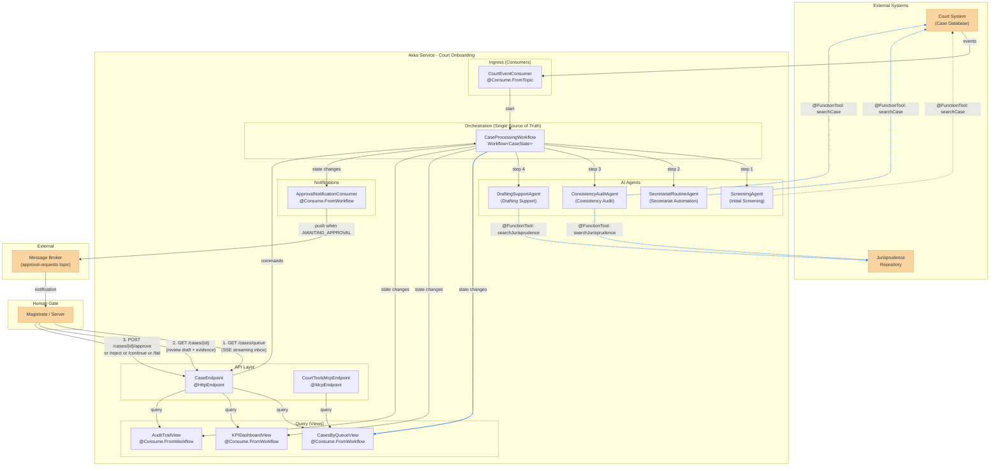
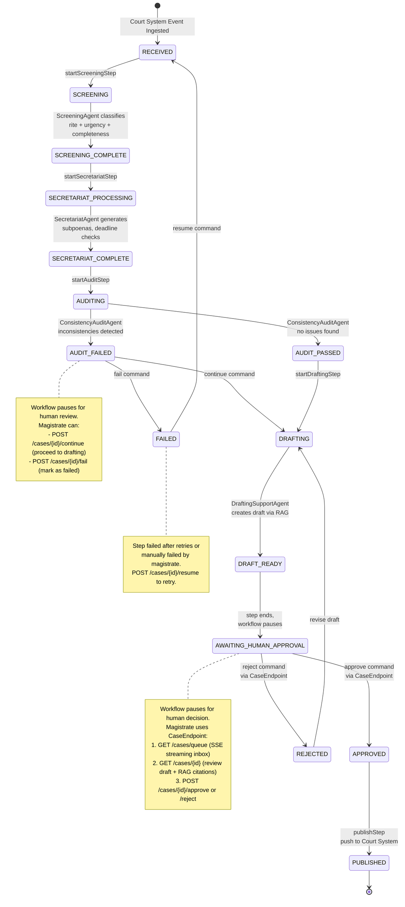
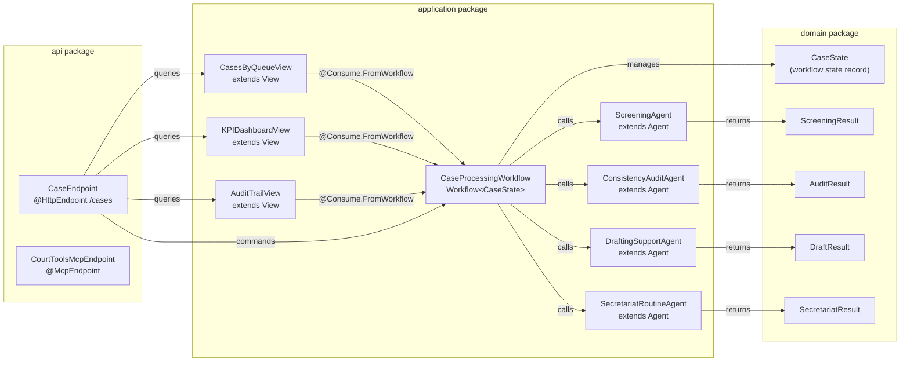
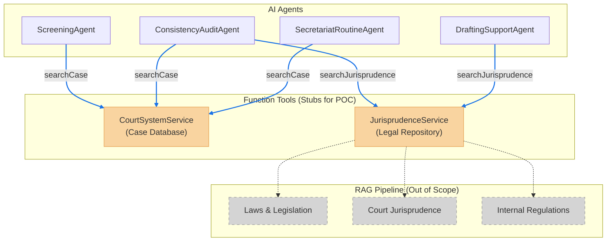
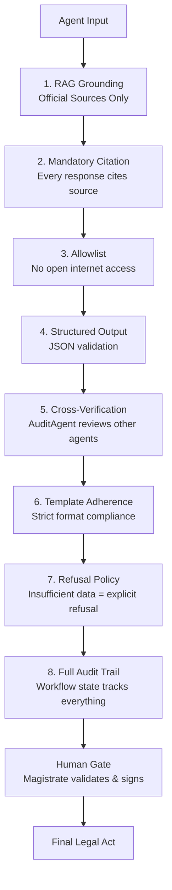

# Court Onboarding - AI Agents for Courts

AI Agents to support court activities -- enhancing analysis, organization, and service capacity without replacing human decision-making.

## Architecture Overview

### High-Level System Architecture



### Case Processing Workflow (Lifecycle)

The `CaseProcessingWorkflow` is the single source of truth. Its `CaseState` holds all verifications, RAG evidence, agent results, and human approvals. Views subscribe directly to Workflow state changes.

When the Workflow reaches `AWAITING_HUMAN_APPROVAL`, it pauses and waits for an external command. The `CasesByQueueView` streams real-time updates via SSE to the dashboard UI, acting as the Magistrate's inbox. The Magistrate reviews case details and approves/rejects via `CaseEndpoint`, which sends a command back to the Workflow. Audit failures and step failures also pause for human intervention.



### Akka Component Detail Map



### Agent Tool Integration (@FunctionTool)

Each agent connects to external systems via `@FunctionTool`-annotated service interfaces injected as tools. For the POC, tools are implemented as **stubs** returning hardcoded data. The RAG pipeline behind the Jurisprudence Repository is out of scope.



### Guardrails & Governance Layer



## Data Model

Minimal data model for a prototype. Each agent returns a structured result that gets stored in the Workflow's `CaseState`.

### Enums

```java
public enum ProcedureType { ORDINARY, SUMMARY, FAST_TRACK }

public enum Urgency { LOW, MEDIUM, HIGH, URGENT }

public enum CaseStatus {
    RECEIVED, SCREENING, SCREENING_COMPLETE,
    SECRETARIAT_PROCESSING, SECRETARIAT_COMPLETE,
    AUDITING, AUDIT_PASSED, AUDIT_FAILED,
    DRAFTING, DRAFT_READY,
    AWAITING_HUMAN_APPROVAL, APPROVED, REJECTED,
    PUBLISHED, FAILED
}
```

### Agent outputs

```java
public record ScreeningResult(
    ProcedureType procedureType,
    Urgency urgency,
    boolean documentsComplete,
    List<String> missingDocuments     // empty if complete
) {}

public record SecretariatResult(
    List<String> generatedActs       // e.g. "Subpoena for response", "File joining order"
) {}

public record AuditResult(
    boolean consistent,
    List<String> issues              // empty if consistent
) {}

public record DraftResult(
    String content,                  // the draft text
    List<String> citations           // RAG sources used
) {}
```

### Workflow state (single source of truth)

```java
public record CaseState(
    String caseNumber,               // Court System case identifier
    CaseStatus status,
    ScreeningResult screening,       // null until screening completes
    SecretariatResult secretariat,   // null until secretariat completes
    AuditResult audit,               // null until audit completes
    DraftResult draft,               // null until drafting completes
    String rejectionReason,          // null unless rejected by magistrate
    String failureMessage            // null unless workflow step failed
) {}
```

### View row types

Each View subscribes to `CaseProcessingWorkflow` state changes and projects a subset of `CaseState`.

```java
// CasesByQueueView - Magistrate's inbox (streamed via SSE)
public record CaseQueueEntry(
    String caseNumber,
    String status,
    String procedureType,            // from screening
    String urgency,                  // from screening
    String failureMessage,           // from workflow failure
    String auditIssues               // from audit (joined with ";")
) {}

// KPIDashboardView - Operational metrics
public record KPIEntry(
    String caseNumber,
    CaseStatus status,
    boolean documentsComplete,       // from screening
    boolean auditConsistent,         // from audit
    int auditIssueCount              // from audit
) {}

// AuditTrailView - Governance dashboard
public record AuditTrailEntry(
    String caseNumber,
    CaseStatus status,
    boolean hasScreening,            // screening != null
    boolean hasSecretariat,          // secretariat != null
    boolean hasAudit,                // audit != null
    boolean hasDraft,                // draft != null
    int citationCount                // from draft
) {}
```

## External Tools

Tools available to agents via `@FunctionTool`-annotated service interfaces. **For the POC, all tools are stubs returning hardcoded data.** The RAG pipeline behind the Jurisprudence Repository is out of scope -- it lives behind the external service. Personal data masking is handled by Akka guardrails, not as an external tool.

```java
// Contract for court system integration
public interface CourtSystemService {

    @FunctionTool(description = "Retrieves case documents and metadata from the court system")
    CaseDocuments searchCase(String caseNumber);

    @FunctionTool(description = "Publishes administrative acts back to the court system")
    void updateCase(String caseNumber, List<String> acts);
}

// Contract for legal knowledge base integration
public interface JurisprudenceService {

    @FunctionTool(description = "Searches official legal databases")
    List<CitedSource> searchJurisprudence(String query);
}

public record CaseDocuments(
    String caseNumber,
    String content,                  // full case text
    List<String> attachedDocuments   // URLs to documents in court system
) {}

public record CitedSource(
    String content,                  // relevant excerpt
    String source                    // e.g. "Legal Code Art. 477", "Court Precedent 331"
) {}
```

### Tool access per agent

| Agent | CourtSystemService | JurisprudenceService |
|---|---|---|
| `ScreeningAgent` | `searchCase` | |
| `ConsistencyAuditAgent` | `searchCase` | `searchJurisprudence` |
| `SecretariatRoutineAgent` | `searchCase` | |
| `DraftingSupportAgent` | | `searchJurisprudence` |

### Agent prompts

```
ScreeningAgent:
  "You are a court screening clerk. Given a case number, use the
   searchCase tool to retrieve the case data. Then classify:
   1. The procedure type (ORDINARY, SUMMARY, or FAST_TRACK)
   2. The urgency level (LOW, MEDIUM, HIGH, or URGENT)
   3. Whether all required documents are present
   If documents are missing, list them.
   Respond with a ScreeningResult."

ConsistencyAuditAgent:
  "You are a court auditor. Given a case number, use the searchCase
   tool to retrieve case data and the searchJurisprudence tool to
   validate against legal norms. Verify formal consistency:
   - Dates are valid and not contradictory
   - Claimed values match supporting documents
   - The request is legally coherent
   If you find issues, list each one. Respond with an AuditResult."

SecretariatRoutineAgent:
  "You are a court secretariat assistant. Given a case number, use
   the searchCase tool to retrieve case data. Based on the case data,
   determine which administrative acts are needed (subpoenas, deadline
   notifications, file joining orders).
   Respond with a SecretariatResult."

DraftingSupportAgent:
  "You are a court drafting assistant. Given a case and its audit
   results, use the searchJurisprudence tool to find relevant
   precedents. Draft a decision suggestion based ONLY on retrieved
   jurisprudence. Every statement must cite its source. If insufficient
   legal basis exists, explicitly state that rather than inventing content.
   Respond with a DraftResult."
```

## Akka SDK Components

| Component | Type | Purpose |
|---|---|---|
| `CaseProcessingWorkflow` | Workflow | Single source of truth. Orchestrates Screening -> Secretariat -> Audit -> Drafting -> Human Approval. `CaseState` holds all verifications, RAG evidence, and approvals. |
| `ScreeningAgent` | Agent | Classifies rite, urgency, document completeness |
| `ConsistencyAuditAgent` | Agent | Detects inconsistencies before magistrate review |
| `SecretariatRoutineAgent` | Agent | Automates subpoenas, deadline checks, file joining |
| `DraftingSupportAgent` | Agent | Generates drafts grounded in jurisprudence via RAG |
| `CasesByQueueView` | View | Queue management with SSE streaming updates (subscribes to Workflow) |
| `KPIDashboardView` | View | Operational metrics: triage time, rework rate, etc. (subscribes to Workflow) |
| `AuditTrailView` | View | Governance and compliance dashboard (subscribes to Workflow) |
| `CaseEndpoint` | HTTP Endpoint | REST API for human interaction, approvals, and SSE streaming queue |
| `DashboardEndpoint` | HTTP Endpoint | Serves the single-page dashboard UI at `/` |
| `CourtToolsMcpEndpoint` | MCP Endpoint | Tools for Word/external integrations |
| `CourtEventConsumer` | Consumer | Ingests events from court system |
| `ApprovalNotificationConsumer` | Consumer | Subscribes to Workflow, pushes to message broker when case reaches AWAITING_APPROVAL |

## API Endpoints (curl examples)

### Start a new case

```shell
curl -X POST http://localhost:9000/cases/case-001/start \
  -H 'Content-Type: application/json' \
  -d '{"caseNumber": "CASE-2024-001"}'
```

### Get case state

```shell
curl http://localhost:9000/cases/case-001
```

### Approve a case (when AWAITING_HUMAN_APPROVAL)

```shell
curl -X POST http://localhost:9000/cases/case-001/approve
```

### Reject a case (when AWAITING_HUMAN_APPROVAL)

```shell
curl -X POST http://localhost:9000/cases/case-001/reject \
  -H 'Content-Type: application/json' \
  -d '{"reason": "Insufficient evidence in supporting documents"}'
```

### Resume a failed case

```shell
curl -X POST http://localhost:9000/cases/case-001/resume
```

### Continue from audit failure (when AUDIT_FAILED)

```shell
curl -X POST http://localhost:9000/cases/case-001/continue
```

### Fail a case

```shell
curl -X POST http://localhost:9000/cases/case-001/fail \
  -H 'Content-Type: application/json' \
  -d '{"reason": "Audit issues unresolvable"}'
```

### Stream live workflow updates (SSE)

```shell
curl -N http://localhost:9000/cases/case-001/updates
```

### Stream all cases queue (SSE with real-time updates)

```shell
curl -N http://localhost:9000/cases/queue
```

### Get cases by status

```shell
curl http://localhost:9000/cases/queue/AWAITING_HUMAN_APPROVAL
```

### Get full audit trail

```shell
curl http://localhost:9000/cases/audit-trail
```

### Get audit trail for a specific case

```shell
curl http://localhost:9000/cases/audit-trail/CASE-2024-001
```

### Get KPI dashboard

```shell
curl http://localhost:9000/cases/kpi
```

### Get cases with incomplete documents

```shell
curl http://localhost:9000/cases/kpi/incomplete-documents
```

### Get cases with failed audits

```shell
curl http://localhost:9000/cases/kpi/failed-audits
```

## Build, Run & Deploy

### Prerequisites

- Java 21+
- Maven 3.9+
- Docker
- [Akka CLI](https://doc.akka.io/reference/cli/index.html) (`akka`)

### Run locally

```shell
GOOGLE_AI_GEMINI_API_KEY=your-key-here mvn compile exec:java
```

The dashboard UI is available at `http://localhost:9000/`.

### Run tests

```shell
mvn verify
```

### Build Docker image

```shell
mvn clean install -DskipTests
```

This builds the Docker image `court-onboarding:1.0-SNAPSHOT` via the Akka SDK parent pom.

### Tag and push

Replace `your-registry` with your Docker registry (e.g. Docker Hub username or GCR/ECR path):

```shell
export VERSION=$(date +%Y%m%d%H%M%S)
docker tag court-onboarding:1.0-SNAPSHOT your-registry/court-onboarding:1.0-SNAPSHOT-$VERSION
docker push your-registry/court-onboarding:1.0-SNAPSHOT-$VERSION
```

### Deploy to Akka

#### 1. Create the secret for the Gemini API key

```shell
akka secrets create app-secret \
  --secret-key-value GOOGLE_AI_GEMINI_API_KEY=your-key-here
```

#### 2. Update `service.yaml` image reference

Edit `service.yaml` to point to your pushed image:

```yaml
name: court-onboarding
service:
  env:
    - name: GOOGLE_AI_GEMINI_API_KEY
      valueFrom:
        secretKeyRef:
          name: app-secret
          key: GOOGLE_AI_GEMINI_API_KEY
  image: your-registry/court-onboarding:1.0-SNAPSHOT-20260213165326
  resources:
    runtime:
      mode: embedded
```

#### 3. Deploy the service

```shell
akka service deploy court-onboarding service.yaml
```

#### 4. Check status

```shell
akka service list
akka service logs court-onboarding
```

#### 5. Expose publicly (optional)

```shell
akka service expose court-onboarding --enable-cors
```