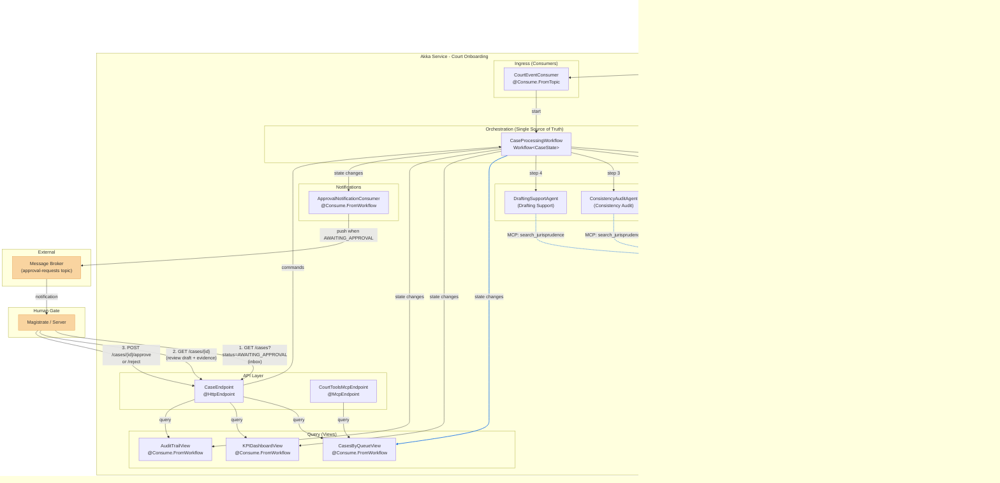

# Court Onboarding - AI Agents for Courts

AI Agents to support court activities -- enhancing analysis, organization, and service capacity without replacing human decision-making.

## Architecture Overview

### High-Level System Architecture



### Case Processing Workflow (Lifecycle)

The `CaseProcessingWorkflow` is the single source of truth. Its `CaseState` holds all verifications, RAG evidence, agent results, and human approvals. Views subscribe directly to Workflow state changes.

When the Workflow reaches `AWAITING_HUMAN_APPROVAL`, it pauses and waits for an external command. The `CasesByQueueView` acts as the Magistrate's inbox (queryable by status). The Magistrate reviews case details and approves/rejects via `CaseEndpoint`, which sends a command back to the Workflow.


### Akka Component Detail Map

```mermaid
graph LR
    subgraph "domain package"
        CaseState["CaseState<br/>(workflow state record)"]
        ScreeningResult["ScreeningResult"]
        AuditResult["AuditResult"]
        DraftDocument["DraftDocument"]
        SecretariatAct["SecretariatAct"]
    end

    subgraph "application package"
        Workflow["CaseProcessingWorkflow<br/>Workflow&lt;CaseState&gt;"]
        SA["ScreeningAgent<br/>extends Agent"]
        CA["ConsistencyAuditAgent<br/>extends Agent"]
        SRA["SecretariatRoutineAgent<br/>extends Agent"]
        DA["DraftingSupportAgent<br/>extends Agent"]
        QV["CasesByQueueView<br/>extends View"]
        KV["KPIDashboardView<br/>extends View"]
        AV["AuditTrailView<br/>extends View"]
    end

    subgraph "api package"
        EP["CaseEndpoint<br/>@HttpEndpoint /cases"]
        MP["CourtToolsMcpEndpoint<br/>@McpEndpoint"]
    end

    Workflow -->|manages| CaseState
    Workflow -->|calls| SA
    Workflow -->|calls| CA
    Workflow -->|calls| SRA
    Workflow -->|calls| DA
    SA -->|returns| ScreeningResult
    CA -->|returns| AuditResult
    DA -->|returns| DraftDocument
    SRA -->|returns| SecretariatAct
    QV -->|@Consume.FromWorkflow| Workflow
    KV -->|@Consume.FromWorkflow| Workflow
    AV -->|@Consume.FromWorkflow| Workflow
    EP -->|queries| QV
    EP -->|queries| KV
    EP -->|queries| AV
    EP -->|commands| Workflow
```

### Agent Tool Integration (MCP)

Each agent connects to external systems exclusively via MCP tools. For the POC, MCP tools are implemented as **stubs** returning hardcoded data. The RAG pipeline behind the Jurisprudence Repository is out of scope.


### Guardrails & Governance Layer


## Data Model

Minimal data model for a prototype. Each agent returns a structured result that gets stored in the Workflow's `CaseState`.

### Enums

```java
public enum ProcedureType { ORDINARY, SUMMARY, FAST_TRACK }

public enum Urgency { LOW, MEDIUM, HIGH, URGENT }

public enum CaseStatus {
    RECEIVED, SCREENING, SECRETARIAT_PROCESSING, AUDITING,
    DRAFTING, AWAITING_HUMAN_APPROVAL, APPROVED, REJECTED, PUBLISHED
}
```

### Agent outputs

```java
public record ScreeningResult(
    ProcedureType procedureType,
    Urgency urgency,
    boolean documentsComplete,
    List<String> missingDocuments     // empty if complete
) {}

public record SecretariatResult(
    List<String> generatedActs       // e.g. "Subpoena for response", "File joining order"
) {}

public record AuditResult(
    boolean consistent,
    List<String> issues              // empty if consistent
) {}

public record DraftResult(
    String content,                  // the draft text
    List<String> citations           // RAG sources used
) {}
```

### Workflow state (single source of truth)

```java
public record CaseState(
    String caseNumber,               // Court System case identifier
    CaseStatus status,
    ScreeningResult screening,       // null until screening completes
    SecretariatResult secretariat,   // null until secretariat completes
    AuditResult audit,               // null until audit completes
    DraftResult draft,               // null until drafting completes
    String rejectionReason           // null unless rejected by magistrate
) {}
```

### View row types

Each View subscribes to `CaseProcessingWorkflow` state changes and projects a subset of `CaseState`.

```java
// CasesByQueueView - Magistrate's inbox
public record CaseQueueEntry(
    String caseNumber,
    CaseStatus status,
    ProcedureType procedureType,     // from screening
    Urgency urgency                  // from screening
) {}

// KPIDashboardView - Operational metrics
public record KPIEntry(
    String caseNumber,
    CaseStatus status,
    boolean documentsComplete,       // from screening
    boolean auditConsistent,         // from audit
    int auditIssueCount              // from audit
) {}

// AuditTrailView - Governance dashboard
public record AuditTrailEntry(
    String caseNumber,
    CaseStatus status,
    boolean hasScreening,            // screening != null
    boolean hasSecretariat,          // secretariat != null
    boolean hasAudit,                // audit != null
    boolean hasDraft,                // draft != null
    int citationCount                // from draft
) {}
```

## External Tools

Tools available to agents via MCP. **For the POC, all tools are stubs returning hardcoded data.** The RAG pipeline behind the Jurisprudence Repository is out of scope -- it lives behind the external service. Personal data masking is handled by Akka guardrails, not as an external tool.

```java
// Contract for court system integration
public interface CourtSystemTools {

    // Retrieves case documents and metadata from court system
    CaseDocuments searchCase(String caseNumber);

    // Publishes administrative acts (subpoenas, deadlines) back to court system
    void updateCase(String caseNumber, List<String> acts);
}

// Contract for legal knowledge base integration
public interface JurisprudenceTools {

    // Searches official legal databases (laws, jurisprudence, internal norms)
    // Returns grounded results with citations
    List<CitedSource> searchJurisprudence(String query);
}

public record CaseDocuments(
    String caseNumber,
    String content,                  // full case text
    List<String> attachedDocuments   // URLs to documents in court system
) {}

public record CitedSource(
    String content,                  // relevant excerpt
    String source                    // e.g. "Legal Code Art. 477", "Court Precedent 331"
) {}
```

### Tool access per agent

| Agent | CourtSystemTools | JurisprudenceTools |
|---|---|---|
| `ScreeningAgent` | `searchCase` | |
| `ConsistencyAuditAgent` | `searchCase` | `searchJurisprudence` |
| `SecretariatRoutineAgent` | `searchCase`, `updateCase` | |
| `DraftingSupportAgent` | | `searchJurisprudence` |

### Agent prompts

```
ScreeningAgent:
  "You are a court screening clerk. Given a case number, use the
   searchCase MCP tool to retrieve the case data. Then classify:
   1. The procedure type (ORDINARY, SUMMARY, or FAST_TRACK)
   2. The urgency level (LOW, MEDIUM, HIGH, or URGENT)
   3. Whether all required documents are present
   If documents are missing, list them.
   Respond with a ScreeningResult."

ConsistencyAuditAgent:
  "You are a court auditor. Given a case number, use the searchCase
   MCP tool to retrieve case data and the searchJurisprudence MCP tool to
   validate against legal norms. Verify formal consistency:
   - Dates are valid and not contradictory
   - Claimed values match supporting documents
   - The request is legally coherent
   If you find issues, list each one. Respond with an AuditResult."

SecretariatRoutineAgent:
  "You are a court secretariat assistant. Given a case number, use
   the searchCase MCP tool to retrieve case data. Generate the required
   administrative acts (subpoenas, deadline notifications, file joining orders).
   Then use the updateCase MCP tool to publish the acts to the court system.
   Respond with a SecretariatResult."

DraftingSupportAgent:
  "You are a court drafting assistant. Given a case and its audit
   results, use the searchJurisprudence MCP tool to find relevant
   precedents. Draft a decision suggestion based ONLY on retrieved
   jurisprudence. Every statement must cite its source. If insufficient
   legal basis exists, explicitly state that rather than inventing content.
   Respond with a DraftResult."
```

## Akka SDK Components

| Component | Type | Purpose |
|---|---|---|
| `CaseProcessingWorkflow` | Workflow | Single source of truth. Orchestrates Screening -> Secretariat -> Audit -> Drafting -> Human Approval. `CaseState` holds all verifications, RAG evidence, and approvals. |
| `ScreeningAgent` | Agent | Classifies rite, urgency, document completeness |
| `ConsistencyAuditAgent` | Agent | Detects inconsistencies before magistrate review |
| `SecretariatRoutineAgent` | Agent | Automates subpoenas, deadline checks, file joining |
| `DraftingSupportAgent` | Agent | Generates drafts grounded in jurisprudence via RAG |
| `CasesByQueueView` | View | Queue management by priority and status (subscribes to Workflow) |
| `KPIDashboardView` | View | Operational metrics: triage time, rework rate, etc. (subscribes to Workflow) |
| `AuditTrailView` | View | Governance and compliance dashboard (subscribes to Workflow) |
| `CaseEndpoint` | HTTP Endpoint | REST API for human interaction and approvals |
| `CourtToolsMcpEndpoint` | MCP Endpoint | MCP tools for Word/external integrations |
| `CourtEventConsumer` | Consumer | Ingests events from court system |
| `ApprovalNotificationConsumer` | Consumer | Subscribes to Workflow, pushes to message broker when case reaches AWAITING_APPROVAL |